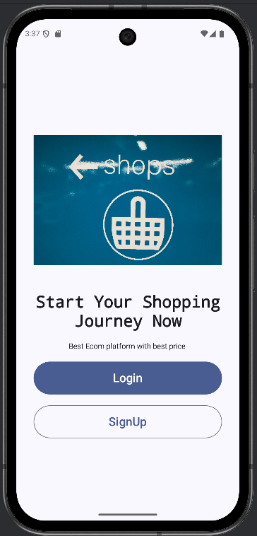
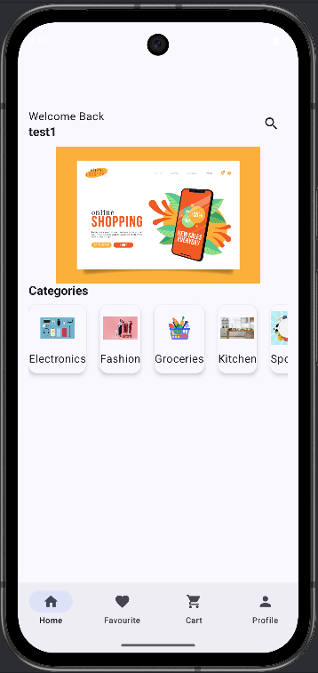
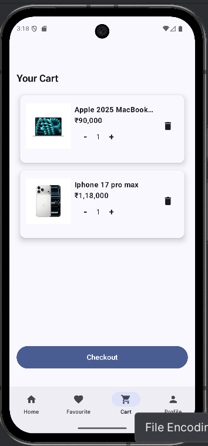
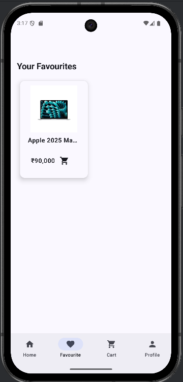
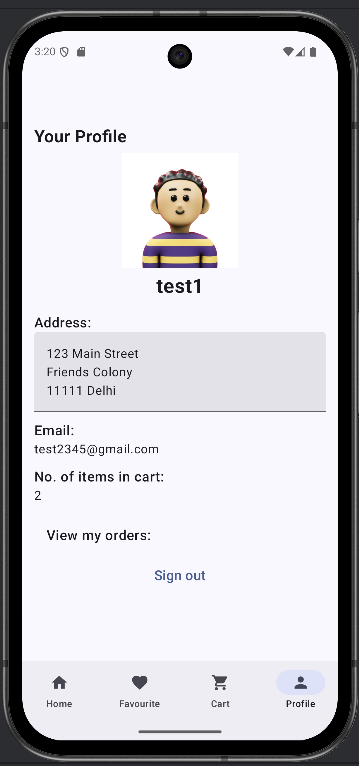
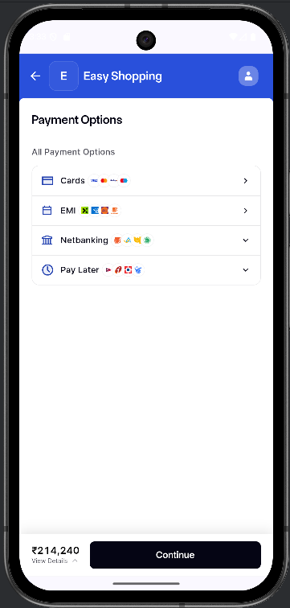

🛍️ Easy Shopping App

An Android E-Commerce application built using Kotlin and Jetpack Compose that allows users to browse products, manage cart & wishlist, and make secure online payments using Razorpay.

🚀 Features

1. 🔐 User Authentication (Firebase)
2. 🛒 Add to Cart functionality
3. ❤️ Wishlist / Favorites section
4. 🧾 Order Summary screen
5. 💳 Razorpay Payment Integration (Test Mode)
6. 🔄 Real-time data with Firebase Firestore
7. 🎨 Modern UI using Jetpack Compose
8. 📱 Responsive layout for different screen sizes

🛠 Tech Stack

* Language: Kotlin
* UI Toolkit: Jetpack Compose (Material 3)
* Architecture: MVVM
* Database: Firebase Firestore
* Authentication: Firebase Auth
* Payment Gateway: Razorpay Android SDK
* Navigation: Navigation Compose
* State Management: ViewModel + Compose State

📂 Project Structure
com.example.easyshopping
│
├── ui/                → UI Components
├── pages/             → App Screens (Home, Cart, Wishlist)
├── viewmodel/         → Business Logic
├── data/              → Repository & Firebase
├── navigation/        → Navigation Graph
└── theme/             → App Theme

⚙️ Installation & Setup
1️⃣ Clone Repository
git clone https://github.com/your-username/easy-shopping-app.git
2️⃣ Open in Android Studio
Use latest stable version
Minimum SDK: 24+
Target SDK: 34

🔐 Firebase Setup

1. Go to Firebase Console
2. Create a new project
3. Enable: Authentication (Email/Password)
4. Firestore Database
5. Download google-services.json
6. Place it inside: app/google-services.json

💳 Razorpay Setup

1. Create account on Razorpay Dashboard
2. Enable Test Mode
3. Copy Test API Key
4. Add key inside your payment implementation

🛒 Payment Flow

1. User adds products to cart
2. Clicks Checkout
3. Razorpay payment screen opens
4. On successful payment → Order confirmation

📸 Screenshots

## 📸 Screenshots

| Signup                           | Home                           |
|----------------------------------|--------------------------------|
|  |  |

| Cart                           | Favourite                            |
|--------------------------------|--------------------------------------|
|  |  |

| Profile                           | Payment                           |
|-----------------------------------|-----------------------------------|
|  |  |

